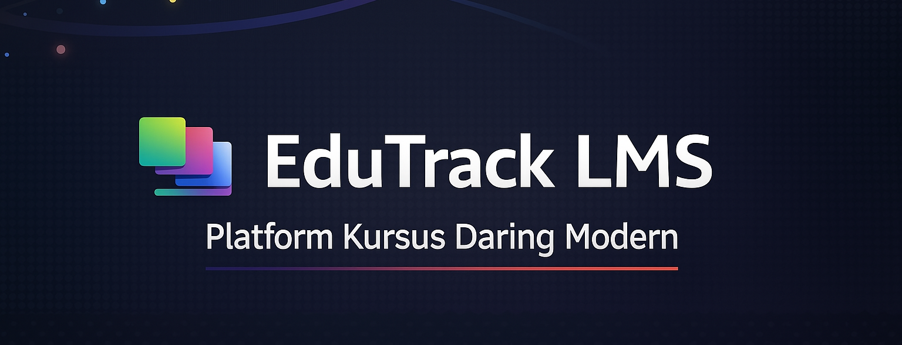
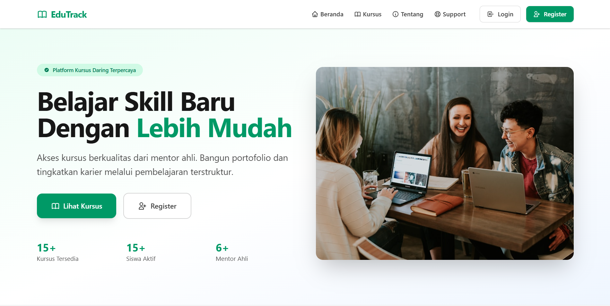
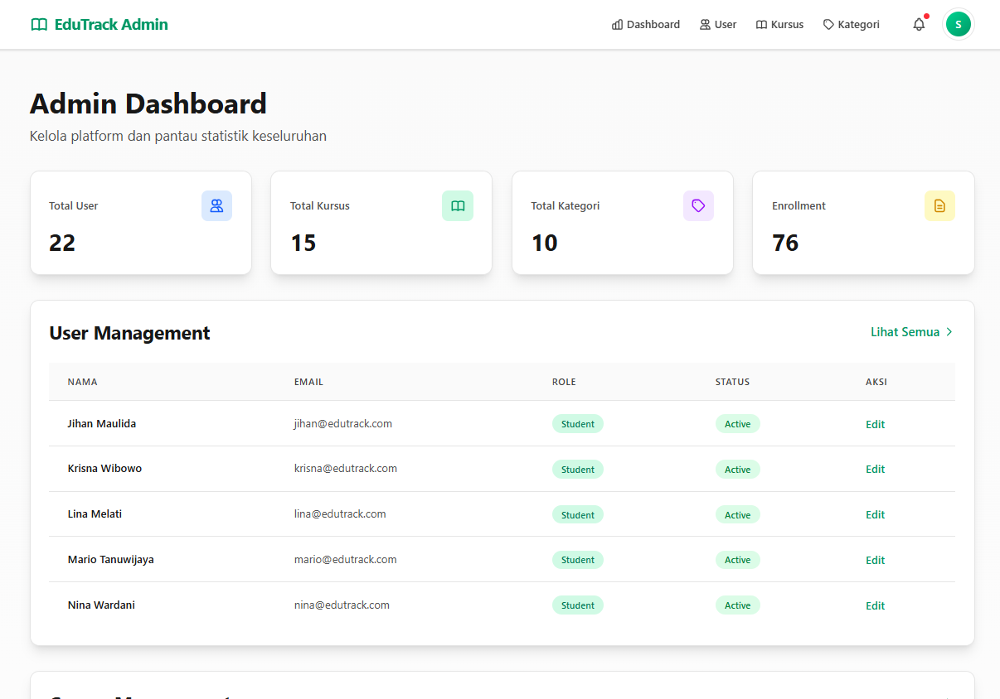
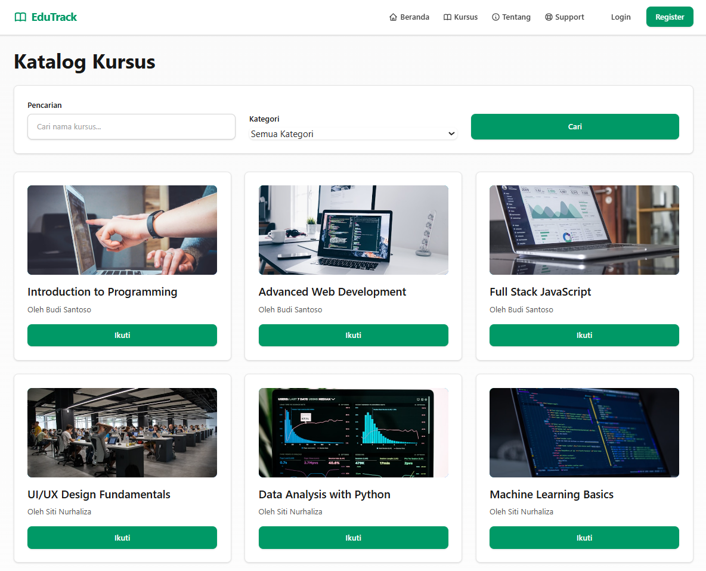
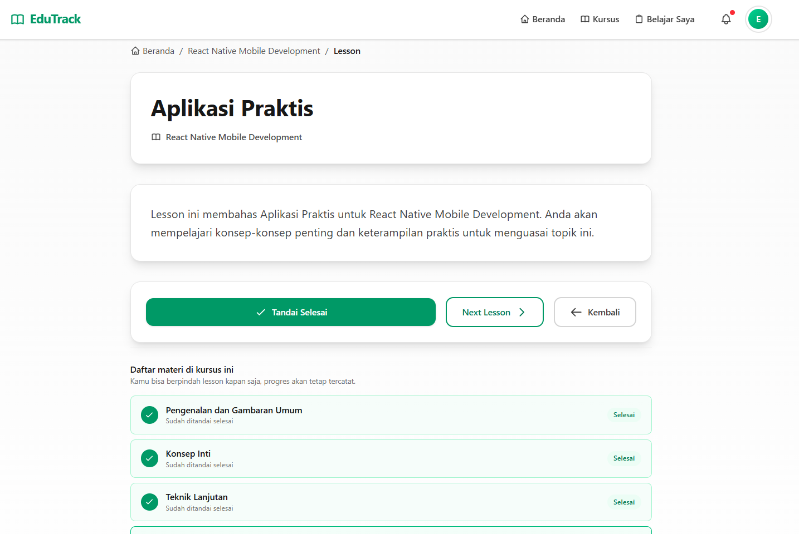
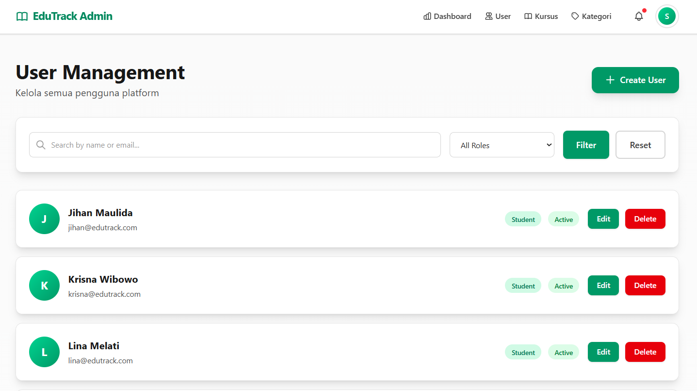
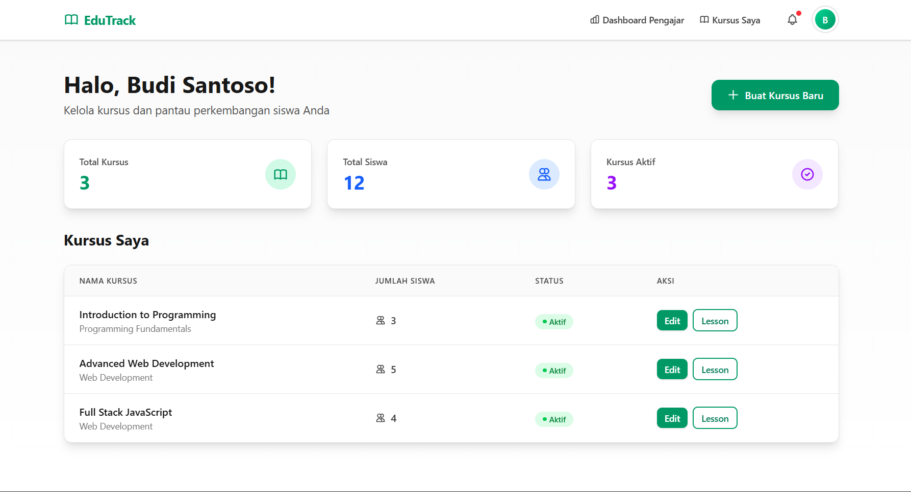
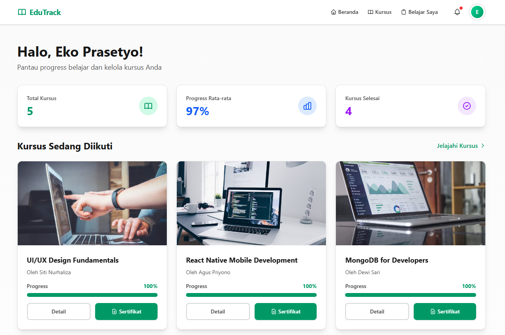

<div align="center">



</div>

<div align="center">


**Platform pembelajaran online yang dirancang untuk memberikan pengalaman belajar terbaik dengan manajemen konten yang komprehensif**

[](#-features) • [](#-installation) • [](#-contributing)

</div>

---

## 📸 Screenshot

### Halaman Utama

*Halaman landing dengan hero section yang menarik dan statistik platform*

### Dashboard Admin

*Dashboard admin dengan statistik komprehensif dan manajemen platform*

### Katalog Kursus

*Katalog kursus dengan filter dan pencarian yang mudah*

### Tampilan Pelajaran

*Tampilan pelajaran dengan pelacakan progress dan navigasi yang intuitif*

### Manajemen Pengguna

*Manajemen pengguna dengan layout card yang modern*

### Dashboard Teacher

*Dashboard teacher dengan daftar kursus yang dibuat dan statistik siswa*

### Dashboard Student

*Dashboard student dengan kursus yang diikuti, progress tracking, dan akses sertifikat*

---

## 📋 Daftar Isi

- [🎯 Tentang Proyek](#-about-project)
- [✨ Fitur](#-features)
- [🛠 Teknologi yang Digunakan](#-technologies-used)
- [💻 Persyaratan Sistem](#-system-requirements)
- [🚀 Instalasi](#-installation)
- [⚙️ Konfigurasi](#-configuration)
- [📁 Struktur Proyek](#-project-structure)
- [📖 Penggunaan](#-usage)
- [📚 Dokumentasi](#-documentation)
- [🧪 Pengujian](#-testing)
- [🤝 Kontribusi](#-contributing)
- [👤 Kontak](#-contact)

---

## 🎯 Tentang Proyek

EduTrack LMS adalah Learning Management System (LMS) yang komprehensif yang dirancang untuk memfasilitasi proses pembelajaran online antara guru dan siswa. Platform ini menyediakan workflow CMS terintegrasi dengan antarmuka yang modern, responsif, dan mudah digunakan.

### 🎯 Tujuan
- 📚 Menyediakan proses pembelajaran terpandu yang lengkap dengan manajemen konten
- 👥 Memfasilitasi interaksi antara guru dan siswa
- 📊 Menyediakan pelacakan progress pembelajaran yang akurat
- 🎨 Memberikan pengalaman pengguna yang modern dan intuitif

### ⭐ Nilai Inti
- ✅ **Integrated CMS Workflow** - Sistem manajemen konten terintegrasi
- ✅ **Clean Design** - Hierarki visual yang jelas dan mudah dipahami
- ✅ **Responsive & Accessible** - Optimal di semua perangkat dengan aksesibilitas tinggi
- ✅ **Modular Architecture** - Mudah untuk diuji, dikembangkan, dan dipelihara
- ✅ **Code Quality** - Validasi Form Request, database transactions, dan error handling yang komprehensif

---

## ✨ Fitur

### 👥 Manajemen Pengguna
- 🔐 **Sistem Multi-role** - Admin, Teacher, Student, dan Guest
- 👤 **Manajemen Pengguna** - CRUD lengkap untuk pengguna dengan filter dan pencarian
- 🛡️ **Role-based Access Control** - Setiap role memiliki akses dan fitur yang berbeda
- ⚙️ **Manajemen Profil** - Pengguna dapat mengelola profil mereka sendiri

### 📚 Manajemen Kursus
- ➕ **Course CRUD** - Membuat, mengedit, dan menghapus kursus dengan mudah
- 🏷️ **Manajemen Kategori** - Mengorganisir kursus berdasarkan kategori
- 🔄 **Status Kursus** - Aktif/Nonaktif untuk kontrol publikasi
- 📅 **Rentang Tanggal** - Penjadwalan kursus dengan tanggal mulai dan akhir
- 👨‍🏫 **Penugasan Guru** - Menugaskan guru ke kursus tertentu

### 📖 Manajemen Konten
- 📝 **Manajemen Pelajaran** - Membuat dan mengelola pelajaran per kursus
- 📋 **Organisasi Konten** - Urutan pelajaran yang dapat dikonfigurasi
- ✍️ **Rich Text Content** - Konten pelajaran dengan format yang kaya
- 📊 **Pelacakan Progress** - Melacak progress pembelajaran per siswa

### 📊 Dashboard & Analytics
- **👨‍💼 Dashboard Admin**:
  - 📈 Statistik untuk total pengguna, kursus, kategori, dan pendaftaran
  - 👥 Pengguna dan kursus terbaru
  - 🏷️ Manajemen kategori terintegrasi
- **👨‍🏫 Dashboard Teacher**:
  - 📚 Ringkasan kursus yang diajarkan
  - 📊 Statistik siswa dan pendaftaran
- **👨‍🎓 Dashboard Student**:
  - 📖 Kursus yang didaftarkan
  - 📈 Pelacakan progress per kursus
  - ✅ Pelajaran yang selesai/belum selesai

### 🎓 Fitur Pembelajaran
- 🎫 **Sistem Pendaftaran** - Siswa dapat mendaftar ke kursus
- 📈 **Pelacakan Progress** - Secara otomatis melacak progress pembelajaran
- ✅ **Tandai Selesai** - Siswa dapat menandai pelajaran sebagai selesai
- 🔄 **Navigasi Pelajaran** - Navigasi yang mudah antar pelajaran
- 🔍 **Katalog Kursus** - Katalog kursus dengan filter dan pencarian
- 🏆 **Penerbitan Sertifikat** - Sertifikat otomatis diterbitkan saat kursus selesai (progress 100%)
- 📄 **Sertifikat PDF** - Unduh sertifikat dalam format PDF

### 🎨 UI/UX Modern
- 📱 **Desain Responsif** - Optimal di semua perangkat
- 🎴 **Layout Berbasis Card** - Desain layout card yang modern
- 🎨 **Tailwind CSS** - Styling framework CSS utility-first
- ✨ **Animasi Halus** - Transisi dan animasi yang halus
- ♿ **Aksesibilitas** - Aksesibilitas tinggi untuk semua pengguna
- 🖼️ **Gambar Dinamis** - Variasi gambar otomatis untuk menghindari tampilan monoton

### 🔧 Fitur Teknis
- ✅ **Form Request Validation** - Validasi terstruktur dengan pesan error kustom
- 💾 **Database Transactions** - Operasi atomik untuk integritas data
- 🛡️ **Error Handling** - Penanganan error yang komprehensif dengan logging detail
- 📝 **Code Quality** - Kode bersih tanpa file dan komentar yang tidak terpakai
- 🔍 **Eager Loading** - Query yang dioptimalkan untuk menghindari masalah N+1

---

## 🛠 Teknologi yang Digunakan

### 🔧 Backend

  - PHP Framework

  - Bahasa Pemrograman

  - Sistem Manajemen Database

  - Database Abstraction Layer

### 🎨 Frontend

  - Templating Engine

  - Framework CSS Utility-first

  - Framework JavaScript Ringan

  - Build Tool dan Development Server

### 🛠️ Development Tools

  - Authentication Scaffolding

  - Code Style Fixer

  - Framework Testing PHP

  - Generasi PDF untuk Sertifikat

---

## 💻 Persyaratan Sistem


---

## 🚀 Instalasi

### 1️⃣ Clone Repository

```bash
git clone https://github.com/ShinZeleo/edutrack-lms.git
cd edutrack-lms
```

### 2️⃣ Install Dependencies

```bash
# Install dependensi PHP
composer install

# Install dependensi Node.js
npm install
```

### 3️⃣ Setup Environment

```bash
# Salin file environment
cp .env.example .env

# Generate application key
php artisan key:generate
```

### 4️⃣ Konfigurasi Database

Edit file `.env` dan sesuaikan konfigurasi database:

```env
DB_CONNECTION=mysql
DB_HOST=127.0.0.1
DB_PORT=3306
DB_DATABASE=edutrack_lms
DB_USERNAME=your_username
DB_PASSWORD=your_password
```

### 5️⃣ Jalankan Migrasi dan Seeder

```bash
# Jalankan migrasi
php artisan migrate

# Seed database dengan data dummy
php artisan db:seed
```

### 6️⃣ Build Assets

```bash
# Development
npm run dev

# Production
npm run build
```

### 7️⃣ Jalankan Server

```bash
# Development server
php artisan serve

# Atau dengan queue dan vite
composer run dev
```

🌐 Akses aplikasi di: `http://localhost:8000`

---

## ⚙️ Konfigurasi

### 🔑 Kredensial Default

Setelah menjalankan seeder, Anda dapat login dengan:

**👨‍💼 Admin:**
- 
- 

**👨‍🏫 Teacher:**
- 
- 

**👨‍🎓 Student:**
- 
- 

### Environment Variables

Beberapa variabel penting di `.env`:

```env
APP_NAME="EduTrack LMS"
APP_ENV=local
APP_DEBUG=true
APP_URL=http://localhost:8000

# Database
DB_CONNECTION=mysql
DB_HOST=127.0.0.1
DB_PORT=3306
DB_DATABASE=edutrack_lms
DB_USERNAME=root
DB_PASSWORD=
```

---

## 📁 Struktur Proyek


### 📂 Direktori Utama

 **app/** - Aplikasi Laravel utama

 **database/** - Migrasi dan seeder database

 **resources/** - Views, CSS, dan assets

 **routes/** - Definisi route aplikasi

 **tests/** - Unit dan feature tests

```
edutrack-lms/
├── app/
│   ├── Http/
│   │   ├── Controllers/
│   │   │   ├── Admin/
│   │   │   │   └── UserController.php
│   │   │   ├── AdminController.php
│   │   │   ├── CategoryController.php
│   │   │   ├── CertificateController.php
│   │   │   ├── CourseController.php
│   │   │   ├── EnrollmentController.php
│   │   │   ├── HomeController.php
│   │   │   ├── LessonController.php
│   │   │   └── ProfileController.php
│   │   ├── Requests/
│   │   │   ├── Auth/
│   │   │   │   └── LoginRequest.php
│   │   │   ├── CategoryStoreRequest.php
│   │   │   ├── CategoryUpdateRequest.php
│   │   │   ├── CourseStoreRequest.php
│   │   │   ├── CourseUpdateRequest.php
│   │   │   ├── LessonStoreRequest.php
│   │   │   ├── LessonUpdateRequest.php
│   │   │   ├── ProfileUpdateRequest.php
│   │   │   ├── UserStoreRequest.php
│   │   │   └── UserUpdateRequest.php
│   │   └── Middleware/
│   │       ├── AdminMiddleware.php
│   │       ├── RoleMiddleware.php
│   │       ├── StudentMiddleware.php
│   │       └── TeacherMiddleware.php
│   └── Models/
│       ├── Category.php
│       ├── Certificate.php
│       ├── Course.php
│       ├── Lesson.php
│       ├── LessonProgress.php
│       └── User.php
├── database/
│   ├── migrations/
│   └── seeders/
│       └── DemoSeeder.php
├── resources/
│   ├── views/
│   │   ├── admin/
│   │   ├── auth/
│   │   ├── certificates/
│   │   ├── courses/
│   │   ├── lessons/
│   │   ├── layouts/
│   │   └── users/
│   └── css/
├── routes/
│   ├── web.php
│   └── auth.php
├── tests/
│   └── Feature/
├── docs/
│   ├── controllers.md
│   ├── database.md
│   ├── models.md
│   ├── routes.md
│   ├── tests.md
│   ├── views.md
│   └── screenshots/
├── .env.example
├── composer.json
├── package.json
└── README.md
```

### 📄 File Penting

  - Dependensi PHP

  - Dependensi Node.js

  - Template konfigurasi environment

---

## 📖 Penggunaan

### 👨‍💼 Untuk Admin

1. 🔐 **Login** sebagai admin
2. 📊 **Dashboard** - Melihat statistik platform
3. 👥 **Manajemen Pengguna** - Mengelola semua pengguna (Admin, Teacher, Student)
4. 📚 **Manajemen Kursus** - Membuat, mengedit, dan menghapus kursus
5. 🏷️ **Manajemen Kategori** - Mengelola kategori kursus

### 👨‍🏫 Untuk Teacher

1. 🔐 **Login** sebagai teacher
2. 📊 **Dashboard** - Melihat kursus yang diajarkan
3. ➕ **Buat Kursus** - Membuat kursus baru
4. 📝 **Kelola Pelajaran** - Menambah dan mengelola pelajaran dalam kursus
5. 👥 **Lihat Siswa** - Melihat siswa yang terdaftar di kursus

### 👨‍🎓 Untuk Student

1. 🔐 **Daftar/Login** sebagai student
2. 🔍 **Jelajahi Kursus** - Menjelajahi katalog kursus
3. 🎫 **Daftar** - Mendaftar ke kursus yang diinginkan
4. 📖 **Belajar** - Mengakses pelajaran dan materi pembelajaran
5. 📈 **Lacak Progress** - Melihat progress pembelajaran
6. 🏆 **Unduh Sertifikat** - Mengunduh sertifikat setelah menyelesaikan kursus (progress 100%)

---

## 📚 Dokumentasi

Dokumentasi lengkap tersedia di folder `docs/` untuk membantu memahami struktur dan implementasi aplikasi:

### 📄 File Dokumentasi

- **[docs/controllers.md](docs/controllers.md)**
  Ikhtisar setiap controller beserta alur request → controller → response, middleware yang digunakan, penggunaan Form Request, transaksi database, dan error handling pattern.
- **[docs/models.md](docs/models.md)**
  Diagram relasi antar model, penjelasan setiap relationship (hasMany, belongsTo, belongsToMany), scopes, accessor/mutator, serta contoh query yang optimal.
- **[docs/views.md](docs/views.md)**
  Struktur folder Blade, penjelasan layout & component, contoh Blade directive, cara menampilkan error/flash message, serta guideline Tailwind untuk styling.
- **[docs/routes.md](docs/routes.md)**
  Daftar lengkap routes (public, auth, admin, teacher, student), middleware stack yang melindungi tiap route, contoh route model binding, dan naming convention.
- **[docs/middleware.md](docs/middleware.md)**
  Penjelasan workflow middleware (auth, role-based, verified), urutan eksekusi, contoh error/redirect, serta best practice fail-fast authorization.
- **[docs/database.md](docs/database.md)**
  Dokumentasi schema database, detail tiap migration, strategi cascade delete, diagram ERD, serta tips menjalankan/rollback migration.
- **[docs/tests.md](docs/tests.md)**
  Struktur test suite, contoh Arrange-Act-Assert, daftar assertion yang digunakan, serta panduan menjalankan test parsial maupun penuh.

### 🎯 Fitur yang Didokumentasikan

- ✅ **Form Request Classes** - Validasi terstruktur dengan pesan error kustom
- ✅ **Database Transactions** - Operasi atomik untuk integritas data
- ✅ **Error Handling** - Penanganan error yang komprehensif dengan logging
- ✅ **Certificate System** - Generasi PDF dan penerbitan sertifikat
- ✅ **Progress Tracking** - Auto-generate sertifikat saat progress mencapai 100%
- ✅ **Role-based Access Control** - Authorization untuk setiap role

---

## 🧪 Pengujian

```bash
# Jalankan semua tests
php artisan test

# Jalankan test spesifik
php artisan test --filter TestClassName

# Jalankan dengan coverage
php artisan test --coverage
```

### 📊 Test Coverage

 ✅ Authentication Tests

 ✅ Authorization Tests

 ✅ Enrollment Tests

 ✅ Course Management Tests

 ✅ Lesson Management Tests

 ✅ Profile Management Tests

---

## 🤝 Kontribusi

Kontribusi sangat diterima! Untuk berkontribusi:

1. 🍴 **Fork** repository
2. 🌿 **Buat** feature branch (`git checkout -b feature/AmazingFeature`)
3. 💾 **Commit** perubahan Anda (`git commit -m 'Add some AmazingFeature'`)
4. 📤 **Push** ke branch (`git push origin feature/AmazingFeature`)
5. 🔄 **Buka** Pull Request


---

## 👤 Kontak

 [@ShinZeleo](https://github.com/ShinZeleo)

 : [https://github.com/ShinZeleo/edutrack-lms](https://github.com/ShinZeleo/edutrack-lms)

---

<div align="center">


⭐ Jika proyek ini membantu Anda, berikan bintang di repository!

</div>
